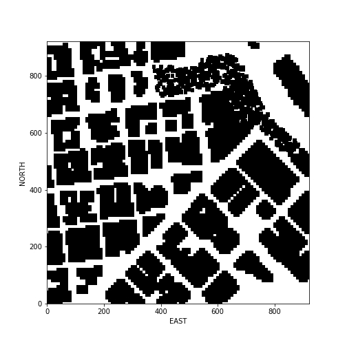
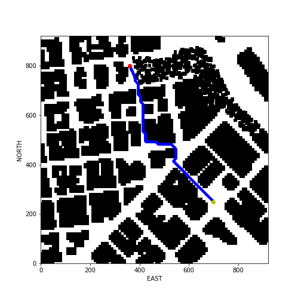
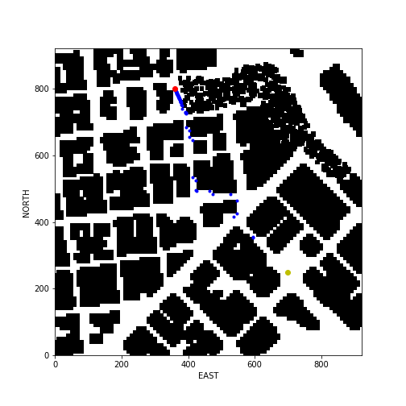

## Project: 3D Motion Planning
### This is project 2 of the Udacity Flying Car Nanodegree


---


# Required Steps for a Passing Submission:
1. Load the 2.5D map in the colliders.csv file describing the environment.
2. Discretize the environment into a grid or graph representation.
3. Define the start and goal locations.
4. Perform a search using A* or other search algorithm.
5. Use a collinearity test or ray tracing method (like Bresenham) to remove unnecessary waypoints.
6. Return waypoints in local ECEF coordinates (format for `self.all_waypoints` is [N, E, altitude, heading], where the drone’s start location corresponds to [0, 0, 0, 0].
7. Write it up.
8. Congratulations!  Your Done!

## [Rubric](https://review.udacity.com/#!/rubrics/1534/view) Points
### Here I will consider the rubric points individually and describe how I addressed each point in my implementation.  

---
### Writeup / README

### Explain the Starter Code

#### 1. Explain the functionality of what's provided in `motion_planning.py` and `planning_utils.py`
These scripts contain a basic planning implementation that includes...
* A state machine flying a simple path from (N=0, E=0) to (N=10, E=10) with the drones position as starting point
* A* search algorithm able to search a rectangular path in a grid
* Create a grid from map data



### Implementing Your Path Planning Algorithm

#### 1. Set your global home position
The drone must be able to start from anywhere in the map. The Python `open()` function is used to open `colliders.csv` and read the first line of the file with the longitude and latitude coordinates. The `split()` seperates these two and the meta strings are removed with the `replace()` function and the pure numbers are converted to float.
The `set_home_position()` function of the `Drone` class sets the global home with these coordinates and an altitude of `0`.

#### 2. Set your current local position
Using the drone's global position and the global home position as inputs for  `global_to_local()` from the `udacidrone.frame_utils` to get the local NED coordinates as output relative to the global home position.

#### 3. Set grid start position from local position
After creating a grid covering all points from `colliders.csv` the local NED position of the drone shifted by the grid offsets is set as starting point in this grid. 

#### 4. Set grid goal position from geodetic coords
To be more flexible command line arguments `goal_lon`, `goal_lat`, `goal_alt` were added to set the goal position in geodetic format. These geodetic coordinates are converted to local coordinates and also shifted by the grid offsets to set the local grid goal.

Example of invoking the script with goal cooardinates:
```
python motion_planning.py --goal_lon 37.792945 --goal_lat -122.397513 --goal_alt 5
``` 

#### 5. Modify A* to include diagonal motion (or replace A* altogether)
In `planning_utils.py` the A* method diagonal motions with the cost of sqrt(2) are added. This reduces the jerky movements from right angle movements only.

#### 6. Cull waypoints 
The function `prune_path` function in `planning_utils.py` uses a collinearity test to reduce waypoins on a straight line. The resulting path from the A* search is used as input. 

Images comparing the non-pruned and pruned path waypoints explains it best:

Non Pruned Path Waypoints  |  Pruned Path Waypoints
:-------------------------:|:-------------------------:
 | 

### Execute the flight
#### 1. Does it work?
It works!
